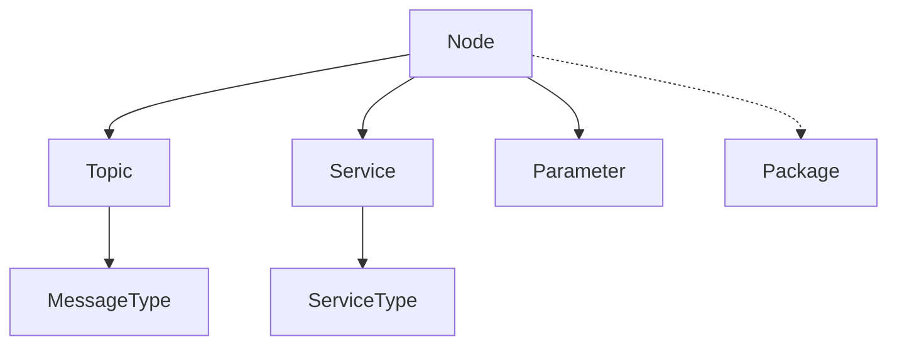

# Design Decisions and Architecture Evolution

## Background and Motivation

This document captures key architectural decisions and their rationale, based on extensive discussion and analysis. The primary goal is to create a tool that can effectively analyze ROS systems from multiple perspectives while maintaining clarity and avoiding complexity.

### Key Insights
- **Separation of Concerns**: Initially, we tried to handle multiple analysis modes simultaneously, leading to data conflicts and unclear outputs. Our discussion revealed that keeping modes separate would significantly reduce complexity.
- **Data Organization**: The original design nested components (like nodes) within packages, making it difficult to generate different views of the system. We decided to move to a flatter structure with explicit relationships.
- **User Experience**: Users typically want to analyze specific aspects of their ROS system rather than getting a complete dump of all information. This insight drove our filtering system design.

## Table of Contents
1. [Analysis Modes](#analysis-modes)
2. [Data Models](#data-models)
3. [Output Organization](#output-organization)
4. [Filtering System](#filtering-system)
5. [Perspectives System](#perspectives-system)

## Analysis Modes

### Core Principle: Mode-First Analysis
A fundamental realization from our discussions was that trying to merge data from different analysis modes (static, runtime, historical) creates more problems than it solves. Instead, we decided to:

1. Make modes mutually exclusive
2. Ensure each mode has a clear, single source of truth
3. Maintain consistent output formats across modes
4. Be explicit about each mode's capabilities and limitations

This approach helps users:
- Understand exactly where their data comes from
- Avoid confusion about data sources
- Get consistent results for each type of analysis

```bash
# Mode Selection via Subcommands
ros-to-markdown static /path/to/workspace  # Static code analysis
ros-to-markdown runtime                    # Live system analysis
ros-to-markdown historical /path/to/bag    # Bag file analysis
```

### Mode Characteristics

#### Static Analysis
- **Purpose**: Analyze source code and build configuration
- **Input**: ROS workspace directory
- **Primary Artifacts**:
  - Package structure
  - Source code analysis
  - Message/service definitions
  - Launch configurations
- **Limitations**:
  - Cannot detect runtime behaviors
  - Missing dynamic configurations

#### Runtime Analysis
- **Purpose**: Analyze live ROS system
- **Input**: Running ROS system (optional namespace)
- **Primary Artifacts**:
  - Active nodes
  - Published topics
  - Available services
  - Parameter values
- **Limitations**:
  - Only sees currently running components
  - May miss inactive configurations

#### Historical Analysis
- **Purpose**: Analyze recorded system behavior
- **Input**: ROS bag file
- **Primary Artifacts**:
  - Message frequencies
  - Data patterns
  - Topic statistics
- **Limitations**:
  - Limited to recorded data
  - Missing system configuration

## Data Models

### Evolution of Data Organization
Our initial design had a hierarchical structure where nodes lived inside packages, which made sense from a code organization perspective but created several problems:

1. **Data Access**: Getting a list of all nodes required traversing package structures
2. **Multiple Sources**: Nodes could come from both static analysis and runtime, leading to conflicts
3. **Relationship Complexity**: Hard to represent cross-package relationships

### Core Principle: Consistent Models Across Modes
A key insight was that while data collection methods differ, the fundamental entities (nodes, topics, etc.) remain the same. This led to:

1. **Unified Models**: Same data structures regardless of source
2. **Clear Relationships**: Explicit rather than implicit connections
3. **Source Tracking**: Optional metadata about how/where data was collected

```python
@dataclass
class Node:
    """ROS node representation."""
    name: str
    namespace: str
    package: Optional[str]
    publishers: List[Topic]
    subscribers: List[Topic]
    services: List[Service]
    parameters: List[Parameter]
    
@dataclass
class Topic:
    """ROS topic representation."""
    name: str
    message_type: str
    publishers: List[str]  # Node names
    subscribers: List[str] # Node names
    frequency: Optional[float]
    bandwidth: Optional[float]

# Collection varies by mode but output model is consistent
class StaticAnalyzer:
    """Source code analysis."""
    def analyze(self) -> AnalysisResults:
        # Parse source files
        pass

class RuntimeAnalyzer:
    """Live system analysis."""
    def analyze(self) -> AnalysisResults:
        # Query running system
        pass
```

### Relationship Management
Moving away from hierarchical nesting to explicit relationships:



## Output Organization

### Philosophy
The output organization reflects two key principles from our discussion:

1. **Clarity of Source**: Output is organized by mode first, making it clear where data came from
2. **Multiple Perspectives**: Support different views of the same data through the perspectives system

### User-Centric Design
Our discussion revealed that users typically want to:
- See specific aspects of their system (not everything at once)
- Understand relationships between components
- Have different views for different purposes (debugging vs. documentation)

### Directory Structure
```
docs/
├── {mode}/                 # static, runtime, or historical
│   ├── nodes.md           # Individual node details
│   ├── topics.md          # Topic information
│   ├── services.md        # Service definitions
│   ├── parameters.md      # Parameter values
│   └── packages.md        # Package info (static only)
│
└── perspectives/          # Combined views
    ├── ros_graph.md       # Node-topic connections
    ├── data_flow.md       # Topic transformations
    └── package_deps.md    # Package dependencies
```

## Filtering System

### Design Philosophy
The filtering system emerged from the realization that users rarely need to see everything at once. Common use cases include:

- Analyzing specific nodes causing issues
- Understanding how packages interact
- Investigating particular topic connections

### Implementation Strategy
Filters operate at multiple levels:

1. **Collection Time**: Apply filters early when possible
   - Reduces memory usage
   - Improves performance
   - Works best with simple filters

2. **Post-Collection**: For complex patterns
   - Supports advanced filtering logic
   - Allows relationship-based filtering
   - May impact performance

```bash
# Package filtering
--package=my_pkg --package=other_*

# Component filtering
--node=/robot1/* --topic=/sensors/**

# Depth filtering
--depth=1  # Direct dependencies only

# Combined filtering
--package=my_pkg --node=/robot1/* --depth=1
```

### Filter Application
Filters are applied:
1. During data collection when possible
2. Post-collection for complex patterns
3. Before perspective generation

## Perspectives System

### Evolution of the Concept
The perspectives system emerged from our discussion about different ways to view ROS systems. Key insights:

1. **Multiple Views**: Same data can be viewed different ways
2. **User Definition**: Users might want custom views
3. **Composition**: Views might need to be combined

### Relationship Definition
A key question was how to define relationships between components. Options discussed:

1. **Static Definition**:
```yaml
relationships:
  publisher_to_topic:
    from: node
    to: topic
    type: publishes
    attributes: [message_type, frequency]
```

2. **Dynamic Discovery**:
```yaml
relationships:
  - discover: [node_connections]
    attributes: [latency, bandwidth]
```

### Template System
Templates need to:
1. Be flexible enough for custom views
2. Support different output formats
3. Handle missing or partial data
4. Provide clear error messages

### Template Example
```jinja
# ROS Graph: {{ perspective.name }}

## Overview
{{ perspective.description }}

## Node-Topic Connections

### {{ node.name }}
Publishers:

- {{ pub.name }} ({{ pub.message_type }})


Subscribers:

- {{ sub.name }} ({{ sub.message_type }})


```

## Open Questions & Future Considerations

1. **Perspective Composition**
   - How to combine multiple perspectives?
   - Should we support perspective inheritance?

2. **Custom Perspectives**
   - User-defined perspective format
   - Validation requirements
   - Template management

3. **Filtering Complexity**
   - How to handle complex filter patterns?
   - Filter precedence rules
   - Performance implications

4. **Documentation Strategy**
   - Technical vs. user documentation
   - Example-driven documentation
   - Integration with ROS wiki

### Additional Considerations

5. **Performance vs. Flexibility**
   - How to balance powerful features with performance?
   - When to apply filters vs. post-process?
   - Caching strategies for repeated analysis?

6. **User Experience**
   - How to make complex features discoverable?
   - What's the right balance of CLI options?
   - How to handle errors and edge cases?

7. **Integration Possibilities**
   - Integration with ROS 2 command line tools
   - IDE plugins for real-time analysis
   - CI/CD pipeline integration

## Implementation Priorities

Based on our discussion, the implementation priority should be:

1. **Core Framework** (High Priority)
   - Mode-based CLI structure
   - Basic data models
   - Simple output generation

2. **Filtering System** (High Priority)
   - Package filtering
   - Node/topic filtering
   - Basic pattern matching

3. **Perspectives Framework** (Medium Priority)
   - Basic perspectives (ROS graph, etc.)
   - Template system
   - Relationship handling

4. **Advanced Features** (Lower Priority)
   - Custom perspectives
   - Complex filtering
   - Performance optimizations

## Next Steps

1. [ ] Update SRS/SDD with new architecture
2. [ ] Implement mode-based CLI structure
3. [ ] Create basic perspective framework
4. [ ] Add filtering system
5. [ ] Develop documentation strategy 

## Notes and Comments

- Consider creating a separate configuration guide for perspective definitions
- Need to document each mode's capabilities clearly
- Consider adding examples for common use cases
- May need to revisit performance if dealing with large systems 