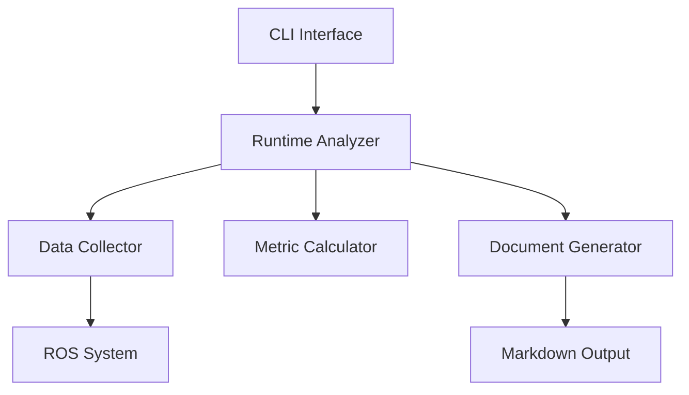

# MVP Technical Specification

## 1. Introduction

### 1.1 Purpose
This document specifies the Minimum Viable Product (MVP) for the ros-to-markdown tool, focusing exclusively on runtime analysis capabilities. It combines both requirements and design decisions to provide a clear implementation path.

### 1.2 Scope
The MVP will:
- Analyze running ROS systems
- Generate markdown documentation
- Provide basic system insights
- Support resource-constrained environments

### 1.3 Design Philosophy
"Do one thing well" - The MVP focuses on runtime analysis, prioritizing:
- Reliability over features
- Clarity over comprehensiveness
- Simplicity over flexibility

## 2. Functional Requirements

### 2.1 Core Functionality
1. **System Discovery**
   - SHALL discover all active ROS nodes
   - SHALL identify node-topic connections
   - SHALL determine message types
   - SHALL measure basic metrics (frequency, resource usage)

2. **Data Collection**
   - SHALL collect data non-intrusively
   - SHALL respect resource limits
   - SHALL handle collection failures gracefully
   - SHALL provide collection progress updates

3. **Analysis**
   - SHALL identify basic patterns
   - SHALL detect simple anomalies
   - SHALL generate system topology
   - SHALL calculate basic statistics

4. **Output Generation**
   - SHALL generate markdown documentation
   - SHALL create mermaid diagrams
   - SHALL highlight potential issues
   - SHALL provide clear metrics

### 2.2 Performance Requirements
1. **Resource Usage**
   - SHALL NOT exceed 1GB RAM
   - SHALL NOT exceed 5% CPU average
   - SHALL scale resource usage based on system capabilities

2. **Timing**
   - SHALL complete analysis within 60 seconds
   - SHALL provide progress updates every 5 seconds
   - SHALL implement configurable timeouts

### 2.3 Reliability Requirements
1. **Error Handling**
   - SHALL implement exponential backoff
   - SHALL provide partial results on failure
   - SHALL clearly indicate failed operations
   - SHALL maintain system stability

## 3. System Architecture

### 3.1 High-Level Components


### 3.2 Core Components

#### 3.2.1 Runtime Analyzer
```python
class RuntimeAnalyzer:
    """Coordinates system analysis."""
    
    def __init__(self, config: AnalyzerConfig):
        self.collector = DataCollector()
        self.calculator = MetricCalculator()
        self.generator = DocumentGenerator()
        
    async def analyze(self) -> AnalysisResult:
        """Main analysis loop."""
        # 1. Collect system data
        # 2. Calculate metrics
        # 3. Generate insights
        # 4. Create documentation
```

#### 3.2.2 Data Collector
```python
class DataCollector:
    """Collects ROS system data."""
    
    async def collect(self) -> SystemData:
        """Collect with backoff and retry."""
        # 1. Discover nodes
        # 2. Get topic info
        # 3. Measure metrics
        # 4. Handle errors
```

#### 3.2.3 Document Generator
```python
class DocumentGenerator:
    """Generates markdown output."""
    
    def generate(self, data: AnalysisResult) -> str:
        """Create markdown documentation."""
        # 1. Apply templates
        # 2. Create diagrams
        # 3. Format metrics
```

### 3.3 Data Flow
1. **Collection Phase**
   ```
   ROS System -> Data Collector -> Raw Data
   ```

2. **Analysis Phase**
   ```
   Raw Data -> Metric Calculator -> Analysis Results
   ```

3. **Generation Phase**
   ```
   Analysis Results -> Document Generator -> Markdown
   ```

## 4. Implementation Details

### 4.1 Error Handling Strategy
```python
class ErrorHandler:
    """Handles collection and analysis errors."""
    
    BACKOFF_CONFIG = {
        'initial': 1.0,
        'max': 30.0,
        'factor': 2.0
    }
    
    async def with_retry(self, operation: Callable):
        """Execute with exponential backoff."""
```

### 4.2 Resource Management
```python
class ResourceManager:
    """Manages system resources."""
    
    LIMITS = {
        'memory_mb': 1024,
        'cpu_percent': 5.0,
        'collection_threads': 4
    }
```

### 4.3 Progress Reporting
```python
class ProgressReporter:
    """Reports analysis progress."""
    
    def update(self, stage: str, progress: float):
        """Update progress with color and formatting."""
```

## 5. Testing Strategy

### 5.1 Unit Tests
- Test each component in isolation
- Mock ROS system interactions
- Verify error handling
- Validate resource management

### 5.2 Integration Tests
- Test with simple ROS systems
- Verify end-to-end workflow
- Measure resource usage
- Validate output accuracy

### 5.3 Performance Tests
- Measure analysis time
- Monitor resource usage
- Test with large systems
- Verify scalability

## 6. Success Metrics

### 6.1 Functional Success
- All core features implemented
- Documentation generated successfully
- Basic insights provided
- Resource limits respected

### 6.2 Performance Success
- Analysis completes in < 60s
- Memory usage < 1GB
- CPU usage < 5%
- Reliable operation

### 6.3 User Success
- Clear documentation
- Useful insights
- Easy to use
- Stable operation

## 7. Future Considerations

While out of scope for MVP, we should consider:
1. Static analysis integration
2. Historical data analysis
3. Custom perspective support
4. Advanced insight generation
5. Plugin system
6. Interactive visualizations

## 8. Implementation Timeline

### Week 1: Core Framework
- [ ] Basic CLI
- [ ] Data collector
- [ ] Resource management
- [ ] Error handling

### Week 2: Analysis
- [ ] Metric calculation
- [ ] Pattern detection
- [ ] Progress reporting
- [ ] Testing framework

### Week 3: Output
- [ ] Template system
- [ ] Markdown generation
- [ ] Diagram creation
- [ ] Documentation 