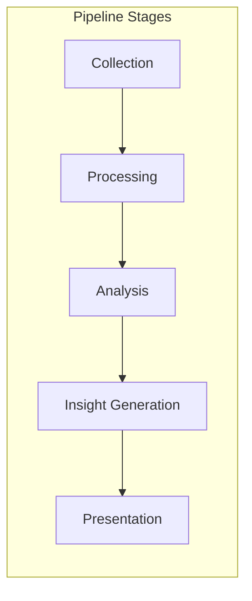

# ROS-to-Markdown Perspective System

## Design Evolution & Discussion

### Initial Problem
Our initial implementation tried to handle everything at once - static analysis, runtime data, and historical data. This led to:
- Confusing data hierarchies (nodes nested in packages)
- Unclear data sources (where did this node info come from?)
- Difficulty generating focused views
- Complex filtering logic

### Key Realizations

During our discussion, several important insights emerged:

1. **Mode Separation**
   - Users typically focus on one type of analysis at a time
   - Mixing modes creates confusion and complexity
   - Each mode should have a clear, single source of truth
   - BUT: We want the ability to combine modes in powerful ways when needed

2. **User Needs**
   - Users rarely need ALL information about their ROS system
   - Different tasks require different views:
     - Debugging might focus on a specific node chain
     - Performance analysis needs system-wide metrics
     - Documentation requires structural information
   - Views should be task-oriented, not data-oriented

3. **Composition Power**
   - Simple primitives can combine to create complex insights
   - Example: Combining node CPU usage with message frequency might reveal bottlenecks
   - Users might discover relationships we never anticipated
   - Need flexibility without overwhelming complexity

### The Perspective Concept

The breakthrough came when discussing how to organize views of ROS systems. We realized we needed:

1. **Flexible Building Blocks**
   ```
   Discussion Point: "Should we maintain separate models for static vs runtime data?"
   Decision: Keep core models consistent but allow different collection methods
   Rationale: Same node concept, different data sources
   ```

2. **Clear Data Flow**
   ```
   Discussion Point: "Should we merge data from multiple sources?"
   Decision: Keep sources separate but allow controlled composition
   Rationale: Avoid confusion, maintain data lineage
   ```

3. **Powerful Composition**
   ```
   Discussion Point: "How do we handle conflicts?"
   Decision: Make data source explicit, use composition rules
   Rationale: Users should always know where data comes from
   ```

### Implementation Challenges

Several challenging questions emerged:

1. **Natural Language Insights**
   ```
   Q: "How would you ascertain that information about LIDAR limiting rate?"
   A: Need multiple layers:
   - Raw data analysis (frequency measurements)
   - Pattern recognition (rate matching)
   - Domain knowledge application
   - Natural language generation
   ```

2. **Performance Considerations**
   ```
   Q: "Should we support parallel/concurrent processing?"
   A: Yes, essential for:
   - Real-time analysis
   - Large systems
   - Multiple perspectives
   Challenge: Managing async operations and data consistency
   ```

3. **Extension Mechanism**
   ```
   Q: "Should we allow custom primitives beyond ROS?"
   A: Yes, needed for:
   - System metrics (CPU, memory)
   - Custom sensors
   - Application-specific data
   Challenge: Maintaining consistency while allowing flexibility
   ```

### Future Considerations

1. **Advanced Output Formats**
   - Current: Focus on Markdown for simplicity
   - Future possibilities:
     - Interactive HTML
     - Jupyter notebooks
     - Grafana dashboards
     - Real-time updates

2. **Integration Opportunities**
   - IDE plugins for development-time insights
   - CI/CD pipeline integration
   - Monitoring system integration
   - LLM-powered analysis

3. **Scaling Considerations**
   - Large ROS systems (100s of nodes)
   - High-frequency data collection
   - Complex perspective compositions
   - Resource management

### Open Questions

1. **Perspective Complexity**
   - How much power should we give users?
   - Should we allow arbitrary Python code in perspectives?
   - How do we validate custom perspectives?

2. **Data Management**
   - How long should we retain collected data?
   - Should we support persistent storage?
   - How do we handle missing data?

3. **User Experience**
   - How do we make this power accessible?
   - What's the learning curve for custom perspectives?
   - How do we handle errors and validation?

## Overview

The perspective system is a powerful, extensible framework for analyzing and visualizing ROS systems. It enables users to:
- Define custom views of their ROS system
- Compose complex analyses from simple primitives
- Create reusable analysis patterns
- Generate insights across different analysis modes

## Core Concepts

### 1. Primitives
Base units that can be analyzed and composed:

```yaml
primitives:
  # ROS Core Primitives
  node:
    attributes: [name, namespace, package, pid]
    metrics: [cpu_usage, memory_usage, uptime]
    relationships: [publishes, subscribes, provides]
    
  topic:
    attributes: [name, type, qos]
    metrics: [frequency, bandwidth, latency]
    relationships: [published_by, subscribed_by]
    
  # System Primitives
  process:
    attributes: [pid, command, user]
    metrics: [cpu_percent, memory_percent, io_stats]
    
  host:
    attributes: [hostname, os, cpu_count]
    metrics: [load_avg, memory_available, network_io]
```

### 2. Relationships
Connections between primitives:

```yaml
relationships:
  # Direct ROS Relationships
  publishes:
    from: node
    to: topic
    attributes: [queue_size, reliability]
    metrics: [publish_rate, dropped_msgs]
    
  # Derived Relationships
  data_flow:
    from: topic
    to: topic
    via: node
    attributes: [transformation_type]
    metrics: [processing_time, success_rate]
```

### 3. Analysis Pipeline


Each stage can be customized:
```yaml
pipeline:
  collection:
    parallel: true
    timeout: 30s
    retry:
      attempts: 3
      backoff: exponential
      
  processing:
    batch_size: 1000
    workers: 4
    
  analysis:
    modules: [frequency, latency, resource]
    depth: 2
    
  insights:
    templates: [bottlenecks, anomalies]
    threshold: 0.8
```

### 4. Perspective Definition

```yaml
perspective:
  name: "Data Flow Analysis"
  description: "Analyze data transformations and bottlenecks"
  version: "1.0"
  modes: [runtime, historical]  # Supported analysis modes
  
  # Input specification
  inputs:
    required:
      - type: topic
        pattern: "/*/sensor_*"
    optional:
      - type: node
        pattern: "*/processor_*"
        
  # Analysis stages
  stages:
    - name: "collect_metrics"
      type: collection
      config:
        metrics: [frequency, latency]
        window: 60s
        
    - name: "analyze_flow"
      type: analysis
      depends_on: ["collect_metrics"]
      config:
        module: data_flow
        params:
          max_depth: 3
          include_transforms: true
          
    - name: "detect_bottlenecks"
      type: analysis
      depends_on: ["analyze_flow"]
      config:
        module: bottleneck_detection
        params:
          sensitivity: 0.8
          
  # Output configuration
  output:
    template: "data_flow.md.j2"
    format: markdown
    sections:
      - flow_diagram
      - bottleneck_analysis
      - performance_metrics
```

### 5. Composition System

Perspectives can be composed using:

```yaml
perspective:
  name: "System Health"
  compose:
    - perspective: data_flow
      params:
        sensitivity: 0.9
        
    - perspective: resource_usage
      params:
        metrics: [cpu, memory]
        
  merge:
    strategy: overlay
    priority: [resource_usage, data_flow]
```

## Implementation Architecture

### 1. Core Components

```python
class PerspectiveEngine:
    """Main engine for perspective processing."""
    
    def __init__(self):
        self.collectors = CollectorRegistry()
        self.analyzers = AnalyzerRegistry()
        self.pipeline = PipelineManager()
        
    async def process_perspective(
        self,
        perspective: Perspective,
        context: AnalysisContext
    ) -> AnalysisResult:
        """Process a perspective definition."""
        # Initialize pipeline
        pipeline = self.pipeline.create(perspective)
        
        # Execute stages
        results = await pipeline.execute(context)
        
        # Generate output
        return self.generate_output(results, perspective.output)

class PipelineStage:
    """Base class for pipeline stages."""
    
    async def execute(
        self,
        input_data: Dict[str, Any],
        config: StageConfig
    ) -> Dict[str, Any]:
        """Execute stage processing."""
        raise NotImplementedError
```

### 2. Extension Points

```python
@dataclass
class CustomPrimitive:
    """Define a new primitive type."""
    name: str
    attributes: List[str]
    metrics: List[str]
    relationships: List[str]
    
    def register(self, registry: PrimitiveRegistry):
        """Register primitive with system."""
        
@dataclass
class CustomAnalyzer:
    """Define a new analysis module."""
    name: str
    input_types: List[str]
    output_types: List[str]
    
    async def analyze(
        self,
        data: AnalysisInput,
        config: AnalyzerConfig
    ) -> AnalysisResult:
        """Perform custom analysis."""
```

## Example Usage

1. **Basic Usage**
```bash
# Use predefined perspective
ros-to-markdown runtime --perspective=data_flow

# Compose perspectives
ros-to-markdown runtime --perspective=data_flow,resource_usage

# Parameterize perspective
ros-to-markdown runtime --perspective=data_flow:sensitivity=0.9
```

2. **Custom Perspective**
```yaml
# my_perspective.yaml
perspective:
  name: "Custom Analysis"
  stages:
    - name: "collect"
      type: collection
      config: {...}
```

```bash
ros-to-markdown runtime --perspective=@my_perspective.yaml
```

## Next Steps

1. [ ] Define standard primitive set
2. [ ] Implement basic pipeline framework
3. [ ] Create core analysis modules
4. [ ] Add composition system
5. [ ] Develop extension mechanisms

## Implementation Work Breakdown Structure

### 1. Define Standard Primitive Set
1.1. ROS Core Primitives
   - [ ] Node primitive
     - [ ] Define core attributes (name, namespace, etc.)
     - [ ] Define metrics (cpu, memory, etc.)
     - [ ] Define relationships (publishes, subscribes)
     - [ ] Implement data collection for each mode
     - [ ] Add validation rules
   
   - [ ] Topic primitive
     - [ ] Define core attributes (name, type, QoS)
     - [ ] Define metrics (frequency, bandwidth)
     - [ ] Define relationships (publishers, subscribers)
     - [ ] Implement data collection
     - [ ] Add validation rules
   
   - [ ] Service primitive
     - [ ] Define attributes
     - [ ] Define metrics
     - [ ] Define relationships
     - [ ] Implement collection
     - [ ] Add validation

1.2. System Primitives
   - [ ] Process primitive
     - [ ] Define OS-level attributes
     - [ ] Define resource metrics
     - [ ] Implement collection methods
     - [ ] Handle different platforms (Linux, macOS) [?]
   
   - [ ] Host primitive
     - [ ] Define system attributes
     - [ ] Define resource metrics
     - [ ] Implement collection
     - [ ] Cross-platform support [?]

1.3. Validation & Testing
   - [ ] Unit tests for each primitive
   - [ ] Integration tests
   - [ ] Performance benchmarks
   - [ ] Documentation

### 2. Implement Pipeline Framework
2.1. Core Pipeline Infrastructure
   - [ ] Pipeline manager
     - [ ] Stage execution engine
     - [ ] Dependency resolution
     - [ ] Error handling
     - [ ] Resource management
   
   - [ ] Data flow management
     - [ ] Inter-stage communication
     - [ ] Data validation
     - [ ] Type checking
     - [ ] Performance monitoring

2.2. Stage Implementation
   - [ ] Collection stage
     - [ ] Parallel collection
     - [ ] Rate limiting
     - [ ] Timeout handling
     - [ ] Retry logic
     - [ ] Error recovery
   
   - [ ] Processing stage
     - [ ] Data transformation
     - [ ] Filtering
     - [ ] Aggregation
     - [ ] Batch processing
   
   - [ ] Analysis stage
     - [ ] Pattern detection
     - [ ] Metric calculation
     - [ ] Relationship analysis
     - [ ] Performance analysis
   
   - [ ] Insight generation
     - [ ] Pattern matching
     - [ ] Natural language generation [?]
     - [ ] Alert generation
     - [ ] Recommendation engine [?]
   
   - [ ] Presentation stage
     - [ ] Template rendering
     - [ ] Format conversion
     - [ ] Output validation

2.3. Pipeline Configuration
   - [ ] YAML schema definition
   - [ ] Configuration validation
   - [ ] Default configurations
   - [ ] Documentation

### 3. Create Core Analysis Modules
3.1. Frequency Analysis
   - [ ] Message rate tracking
   - [ ] Bottleneck detection
   - [ ] Pattern recognition
   - [ ] Anomaly detection

3.2. Latency Analysis
   - [ ] End-to-end measurement
   - [ ] Chain analysis
   - [ ] Bottleneck identification
   - [ ] Historical trending [?]

3.3. Resource Analysis
   - [ ] CPU utilization
   - [ ] Memory usage
   - [ ] Network bandwidth
   - [ ] Disk I/O [?]
   - [ ] Resource correlation

3.4. Graph Analysis
   - [ ] Connection mapping
   - [ ] Cycle detection
   - [ ] Path analysis
   - [ ] Centrality metrics [?]

3.5. Testing & Validation
   - [ ] Unit tests
   - [ ] Integration tests
   - [ ] Performance tests
   - [ ] Documentation

### 4. Add Composition System
4.1. Core Composition
   - [ ] Perspective merger
     - [ ] Data combining rules
     - [ ] Conflict resolution
     - [ ] Validation
   
   - [ ] Pipeline composition
     - [ ] Stage merging
     - [ ] Resource sharing
     - [ ] Optimization

4.2. Parameter Management
   - [ ] Parameter validation
   - [ ] Default handling
   - [ ] Override rules
   - [ ] Documentation

4.3. Testing
   - [ ] Composition tests
   - [ ] Performance impact tests
   - [ ] Error handling tests
   - [ ] Documentation

### 5. Develop Extension Mechanisms
5.1. Plugin System
   - [ ] Plugin interface
   - [ ] Loading mechanism
   - [ ] Validation
   - [ ] Documentation

5.2. Custom Primitives
   - [ ] Registration system
   - [ ] Validation rules
   - [ ] Example implementations
   - [ ] Documentation

5.3. Custom Analyzers
   - [ ] Analyzer interface
   - [ ] Registration system
   - [ ] Example implementations
   - [ ] Documentation

5.4. Custom Relationships
   - [ ] Relationship definition
   - [ ] Validation rules
   - [ ] Example implementations
   - [ ] Documentation

### Notes
- Items marked with [?] need further discussion/clarification
- Each task should include:
  - Implementation
  - Unit tests
  - Integration tests
  - Documentation
  - Examples

### Dependencies
- Task 2 depends on Task 1
- Task 3 depends on Task 2
- Task 4 depends on Tasks 2 and 3
- Task 5 can be partially parallel with Tasks 3 and 4

### Estimated Timeline [?]
- Need to discuss priorities and resource availability
- Some tasks could be parallelized
- Consider breaking into multiple releases

## Cross-Cutting Concerns

### 1. Performance & Scalability
**Discussion:**
Performance emerged as a critical concern when we discussed real-world ROS systems. We realized that:
- Large systems might have hundreds of nodes
- High-frequency topics could generate massive amounts of data
- Users might want to run multiple perspectives simultaneously
- Resource usage needs to be predictable and manageable

**Requirements:**
- [ ] Asynchronous data collection
- [ ] Data sampling strategies
- [ ] Resource usage limits
- [ ] Performance monitoring
- [ ] Caching mechanisms

### 2. Error Handling & Recovery
**Discussion:**
The distributed nature of ROS systems means we need robust error handling:
- Nodes might disappear during analysis
- Network issues could interrupt data collection
- System resources might become constrained
- User-defined perspectives might have bugs

**Requirements:**
- [ ] Graceful degradation
- [ ] Partial results handling
- [ ] Clear error reporting
- [ ] Recovery mechanisms
- [ ] Data validation at boundaries

### 3. Security & Access Control
**Discussion:**
When analyzing running systems, we need to consider:
- Access to system metrics requires privileges
- Network access for remote systems
- Protection against malicious perspective definitions
- Data privacy concerns

**Requirements:**
- [ ] Privilege management
- [ ] Secure connections
- [ ] Perspective validation
- [ ] Data sanitization
- [ ] Access logging

## Risk Assessment

### 1. Technical Risks

#### High Priority
1. **Complexity Overload**
   - Risk: System becomes too complex for users to understand
   - Impact: Low adoption, confusion, errors
   - Mitigation: 
     - Clear documentation
     - Progressive complexity exposure
     - Good defaults
     - Examples for common use cases

2. **Performance Issues**
   - Risk: Analysis becomes too slow for practical use
   - Impact: Tool becomes unusable for large systems
   - Mitigation:
     - Early performance testing
     - Sampling strategies
     - Optimization options
     - Resource limits

#### Medium Priority
3. **Integration Challenges**
   - Risk: Difficulty integrating with various ROS versions/setups
   - Impact: Limited compatibility
   - Mitigation:
     - Abstract ROS interfaces
     - Version-specific adapters
     - Clear compatibility documentation

4. **Extension Complexity**
   - Risk: Extension mechanism becomes too complex
   - Impact: Few custom perspectives/analyzers
   - Mitigation:
     - Simple plugin API
     - Example extensions
     - Extension templates

### 2. Project Risks

#### High Priority
1. **Scope Creep**
   - Risk: Adding too many features
   - Impact: Delayed completion, complexity
   - Mitigation:
     - Clear MVP definition
     - Feature prioritization
     - Regular scope reviews

2. **Resource Constraints**
   - Risk: Limited development resources
   - Impact: Slow progress, quality issues
   - Mitigation:
     - Modular development
     - Community involvement
     - Clear contribution guidelines

#### Medium Priority
3. **Adoption Barriers**
   - Risk: Users find tool too complex
   - Impact: Low adoption
   - Mitigation:
     - User-friendly defaults
     - Good documentation
     - Tutorial videos
     - Example perspectives

### 3. Implementation Risks

#### High Priority
1. **Data Collection Reliability**
   - Risk: Inconsistent/unreliable data collection
   - Impact: Incorrect analysis results
   - Mitigation:
     - Robust error handling
     - Data validation
     - Clear data lineage
     - Quality metrics

2. **Resource Management**
   - Risk: Excessive resource usage
   - Impact: System instability
   - Mitigation:
     - Resource monitoring
     - Usage limits
     - Graceful degradation
     - Clear warnings

## Discussion Notes & Decisions

### Key Decision Points

1. **Pipeline Architecture**
   ```
   Discussion: Should we use a fixed pipeline or allow custom stages?
   Decision: Use a fixed pipeline with customizable stages
   Rationale: Balance flexibility with maintainability
   Impact: Users can customize stage behavior but not overall flow
   ```

2. **Data Model Evolution**
   ```
   Discussion: How to handle different data sources?
   Decision: Core models with source-specific collectors
   Rationale: Maintain consistency while allowing flexibility
   Impact: Simplified data handling, clear source tracking
   ```

3. **Extension Strategy**
   ```
   Discussion: How much power to give users?
   Decision: Layered extension system
   - Level 1: Configuration only
   - Level 2: Custom perspectives
   - Level 3: Custom analyzers
   - Level 4: Custom primitives
   Rationale: Progressive complexity exposure
   ```

### Implementation Priorities

Based on our discussion, we identified these key priorities:

1. **Core Framework (MVP)**
   - Basic primitives
   - Simple pipeline
   - Standard perspectives
   Rationale: Get basic functionality working first

2. **Analysis Capabilities**
   - Frequency analysis
   - Resource monitoring
   - Basic insights
   Rationale: Provide immediate value to users

3. **Extension System**
   - Perspective composition
   - Custom analyzers
   - Plugin system
   Rationale: Enable community contributions
