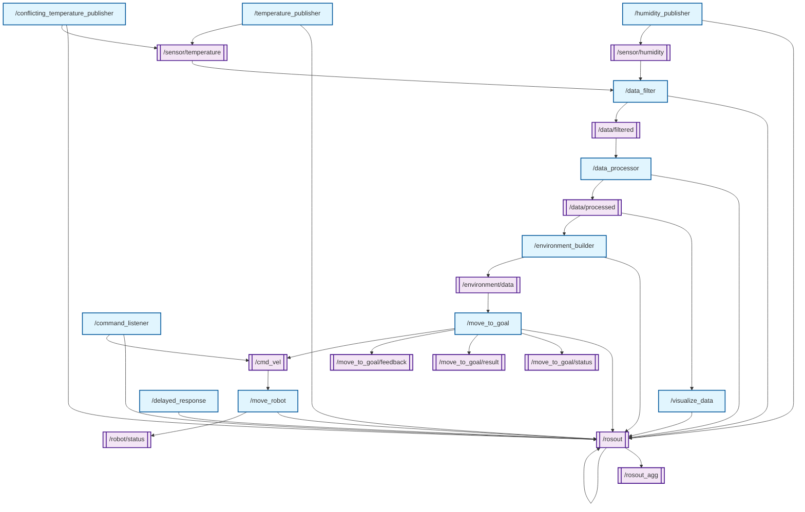

# ROS System Overview

Generated at: 2025-01-27 06:37:11

## Nodes

### /temperature_publisher

**Namespace**: /

Publishers:
- /rosout
- /sensor/temperature

Subscribers:
*No subscribers*

### /environment_builder

**Namespace**: /

Publishers:
- /rosout
- /environment/data

Subscribers:
- /data/processed

### /conflicting_temperature_publisher

**Namespace**: /

Publishers:
- /rosout
- /sensor/temperature

Subscribers:
*No subscribers*

### /rosout

**Namespace**: /

Publishers:
- /rosout_agg

Subscribers:
- /rosout

### /humidity_publisher

**Namespace**: /

Publishers:
- /rosout
- /sensor/humidity

Subscribers:
*No subscribers*

### /move_to_goal

**Namespace**: /

Publishers:
- /rosout
- /move_to_goal/status
- /move_to_goal/result
- /move_to_goal/feedback
- /cmd_vel

Subscribers:
- /environment/data

### /move_robot

**Namespace**: /

Publishers:
- /rosout
- /robot/status

Subscribers:
- /cmd_vel

### /visualize_data

**Namespace**: /

Publishers:
- /rosout

Subscribers:
- /data/processed

### /data_processor

**Namespace**: /

Publishers:
- /rosout
- /data/processed

Subscribers:
- /data/filtered

### /delayed_response

**Namespace**: /

Publishers:
- /rosout

Subscribers:
*No subscribers*

### /command_listener

**Namespace**: /

Publishers:
- /rosout
- /cmd_vel

Subscribers:
*No subscribers*

### /data_filter

**Namespace**: /

Publishers:
- /rosout
- /data/filtered

Subscribers:
- /sensor/humidity
- /sensor/temperature

## Topics

### /rosout_agg

**Type**: rosgraph_msgs/Log

Publishers:
- /rosout

Subscribers:
*No subscribers*

### /rosout

**Type**: rosgraph_msgs/Log

Publishers:
- /humidity_publisher
- /temperature_publisher
- /move_robot
- /conflicting_temperature_publisher
- /visualize_data
- /data_filter
- /data_processor
- /environment_builder
- /move_to_goal
- /delayed_response
- /command_listener

Subscribers:
- /rosout

### /sensor/humidity

**Type**: std_msgs/Float64

Publishers:
- /humidity_publisher

Subscribers:
- /data_filter

### /sensor/temperature

**Type**: std_msgs/Float64

Publishers:
- /temperature_publisher
- /conflicting_temperature_publisher

Subscribers:
- /data_filter

### /robot/status

**Type**: std_msgs/String

Publishers:
- /move_robot

Subscribers:
*No subscribers*

### /data/filtered

**Type**: data_processing/FilteredData

Publishers:
- /data_filter

Subscribers:
- /data_processor

### /data/processed

**Type**: std_msgs/String

Publishers:
- /data_processor

Subscribers:
- /visualize_data
- /environment_builder

### /environment/data

**Type**: environment_integration/EnvironmentData

Publishers:
- /environment_builder

Subscribers:
- /move_to_goal

### /move_to_goal/status

**Type**: actionlib_msgs/GoalStatusArray

Publishers:
- /move_to_goal

Subscribers:
*No subscribers*

### /move_to_goal/result

**Type**: action_server/MoveToGoalActionResult

Publishers:
- /move_to_goal

Subscribers:
*No subscribers*

### /move_to_goal/feedback

**Type**: action_server/MoveToGoalActionFeedback

Publishers:
- /move_to_goal

Subscribers:
*No subscribers*

### /cmd_vel

**Type**: geometry_msgs/Twist

Publishers:
- /move_to_goal
- /command_listener

Subscribers:
- /move_robot

## System Graph

